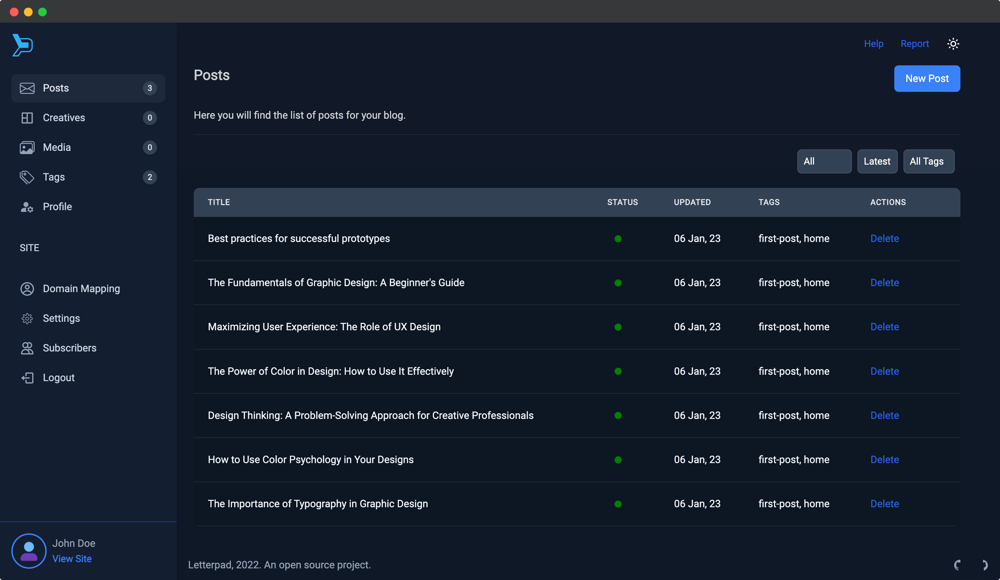

# Letterpad
Letterpad is a blog publishing platform.



## Features

- High performant GraphQL API.
- Uses Graphql, React Apollo, NextJS and Prisma
- Uses TinyMCE editor, specially composed for Letterpad
- Theme customisation (css) from Dashboard.
- Use Language Tool AI Model to check grammar.
- CDN Powered images (Uses cloudinary and Unsplash)
- Connects to multiple databases. Default is sqlite3
- Can be used as a multi-user service
- Minimalistic Dashboard
- Domain Mapping
- Creatives - (Coming soon) - With creatives you will get page builder with which you can create your homepage.

## Demo:
https://demo.letterpad.app

# How to install

Clone this project

```sh
git clone git@github.com:letterpad/letterpad.git
```
Change directory
```sh
cd letterpad
```

## Install dependencies and generate database tables

```sh
yarn install
yarn seed
```

## Production
```sh
yarn build
yarn start
```

## Development
```sh
yarn dev
```

## URL and Port
By default the admin panel runs on port 3000 and client runs on port 3001
- Admin  - http://localhost:3000/admin
- Client - http://localhost:3001

## Letterpad Admin
You can find more information about configuration in this [folder](https://github.com/letterpad/letterpad/tree/master/apps/admin)

## Letterpad Client

The letterpad client (public) app can be found inside `apps/client`.
Demo: https://demo.letterpad.app

Letterpad Admin provides a client key which can be found in settings. If you want to host the client in a different domain, then you should set this client_key in `apps/client/next.config.js`.

## Contribute

You are welcome to contribute to the project. If you find any bugs, please create an issue or a pull request. Also if you would like to have a feature, feel free to inform us with an issue.
