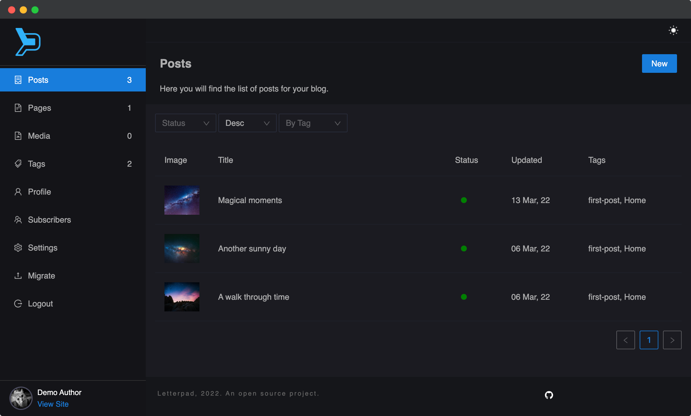

Letterpad Admin is the dashboard for publishing blogs.



## Features

- High performant API.
- Uses Graphql, React Apollo and NextJS
- Uses Letterpad Editor (on top of DraftJS), specially built for this CMS.
- Theme customisation (css) from Dashboard
- CDN Powered images (Uses cloudinary and Unsplash)
- Connects to multiple databases. Default is sqlite3
- Can be used as a multi-user service
- Light and Dark Theme
- Minimalistic Dashboard

## Demo:

https://letterpad.app/admin/login

User Id: demo@demo.com
Password: demo

## Running Letterpad Admin on Production Mode

There are few things that you should know before running letterpad in a production environment.

- In the root folder, you will find a file `env.development.local`. Clone is file and rename it to `env.production.local`. The most important key is `SECRET_KEY`, set the value of this key to something different. This key is used to encrypt passwords, sessions and preview links.

- Letterpad Admin runs on the url `/admin`. If you would like to run the admin dashboard in the root url,
  edit `next.config.js` and remove the basePath. Also open `env.production.local` and remove the `/admin` from all the urls.

- Run the below commands.

```bash
yarn install
yarn seed
yarn build
yarn start # starts the server
```

- Open http://localhost:3000/admin

- Login with demo account

```
Email - demo@demo.com
Password - demo
```

---

## Enabling Emails

Letterpad integrates with [Sendgrid](https://sendgrid.com/). You can add the `SENDGRID_API_KEY` in `.env.production.local` file to activate emails.

---

## Captcha for registrations

This section is required only if you want to use Letterpad as a multi-user account. Letterpad uses [ReCaptcha](https://www.google.com/recaptcha/about/). You can register and set the `RECAPTCHA_KEY` in `env.production.local`.

---

## Running Letterpad on Development Mode

First install the node modules and seed the database using

```bash
yarn install
yarn seed
```

Then, run the development server:

```bash
yarn dev
```

Open [http://localhost:3000/admin](http://localhost:3000/admin) with your browser. You can login with the test account mentioned below

```
Email - demo@demo.com
Password - demo
```

---

Letterpad has been developed using Next.js.
To learn more about Next.js, take a look at the following resources:

- [Next.js Documentation](https://nextjs.org/docs) - learn about Next.js features and API.
- [Learn Next.js](https://nextjs.org/learn) - an interactive Next.js tutorial.

## Letterpad Client

We also have a letterpad client which you can find in [this repository](https://github.com/letterpad/letterpad-client). The letterpad client is a simple react application which uses the graphql API of letterpad to render a public facing blog.
Demo: https://demo.letterpad.app

## Contribute

You are welcome to contribute to the project. If you find any bugs, please create an issue or a pull request. Also if you would like to have a feature, feel free to inform us with an issue.
